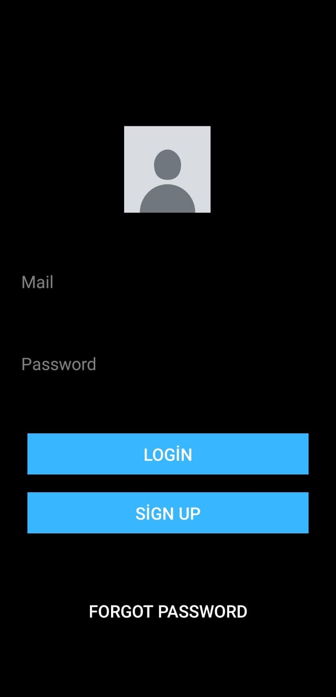

# Kelime Ezberleme Uygulaması

Kelime Ezberleme Uygulaması ile istenen kelimelerin, eklenen  resimler ve cümleler ile birlikte çok daha eğlenceli ve kalıcı bir şekilde ezberlenebilmesini sağlar. Kelime Ezberleme Uygulaması'nda eklenen kelimeleri belirli aralıklarla sınav olarak sorarak kalıcı öğrenmeyi sağlar. Sınav için bu zaman aralıkları soruların doğru veya yanlış bilinmesine bağlı olarak değişmektedir.

## İçindekiler

- [Özellikler](#özellikler)
- [Kurulum](#kurulum)
- [Kullanım](#kullanım)
- [İletişim](#iletişim)

## Özellikler

- Ezberlenmek istenen kelimeyi, resimler ve cümlelerle öğrenmek
- Yapılan sınavlar sonucunda oluşan doğruluk oranlarıyla edinilen başarıyı görüntülemek
- İstenildiği kadar kelime eklenip sınavda istenilen sayıda soru seçmek
- Şifrenin unutulması dahilinde mail ile şifre sıfırlamak

## Kurulum

Kodları çalıştırmak için AndroidStudio' yu kurarak kodları orada açabilir,inceleyebilir,değiştirebilirsiniz. Emülator ile de çıktılarınızı görebilirsiniz.
Kodları görmeden direkt olarak APK dosyasını telefonunuza indirerek uygulamayı kurabilirsiniz.

###kullanım

  
  giriş ekranından mail ve şifre ile giriş yapılabilmektedir.

### İletişim

Sorularınız veya geri bildirimleriniz için bizimle iletişime geçebilirsiniz:
- Email: [soft.eng.abdulkadir@gmail.com](soft.eng.abdulkadir@gmail.com)
- Email: [dumanomer3404@gmail.com](dumanomer3404@gmail.com)
- Email: [simaynglu@gmail.com](simaynglu@gmail.com)
- Email: [enescagritekerek@gmail.com](enescagritekerek@gmail.com)

---

Projenize yıldız vermeyi unutmayın! ⭐

