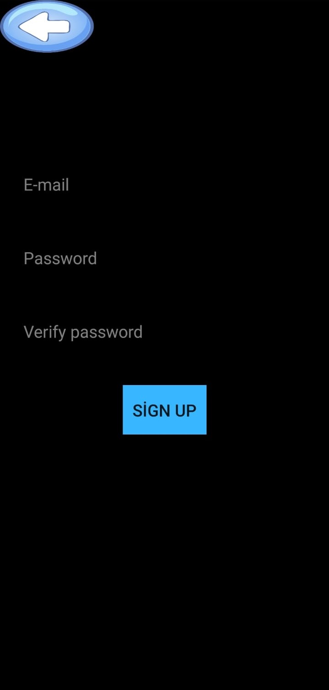
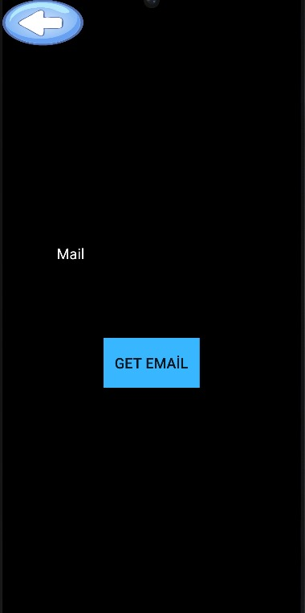
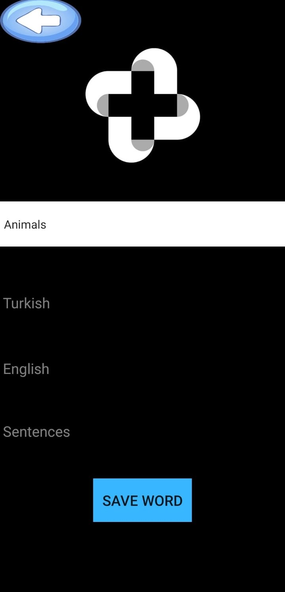
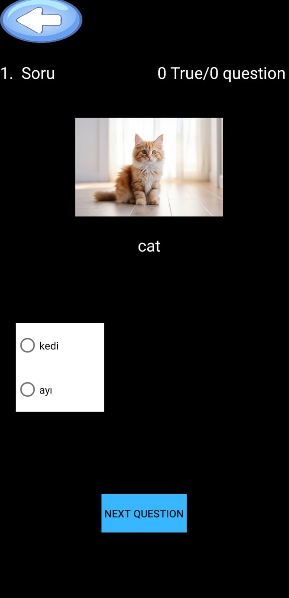
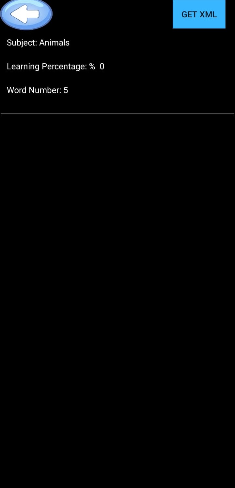
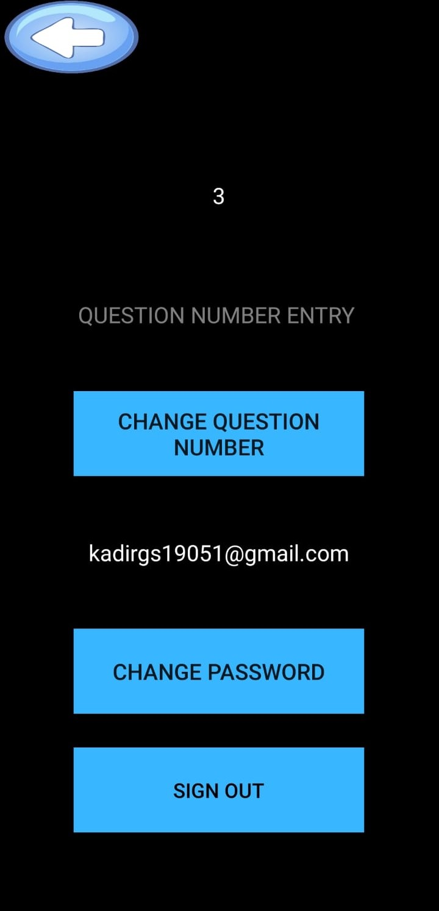
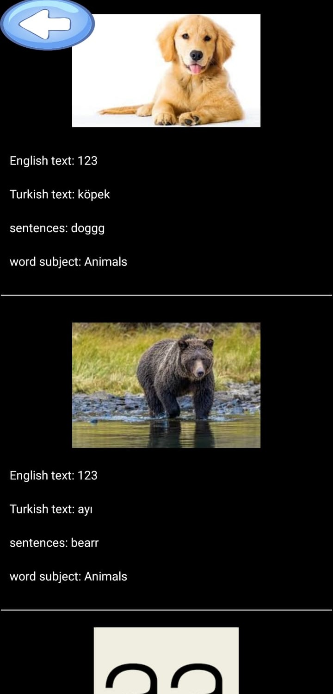

# Kelime Ezberleme Uygulaması

Kelime Ezberleme Uygulaması ile istenen kelimelerin, eklenen resimler ve cümleler ile birlikte çok daha eğlenceli ve kalıcı bir şekilde ezberlenmesi sağlanmaktadır. Kelime Ezberleme Uygulaması'nda eklenen kelimeler belirli aralıklarla sınav olarak sorularak kalıcı öğrenme desteklenmektedir. Sınav için bu zaman aralıkları, soruların doğru veya yanlış bilinmesine bağlı olarak değişmektedir.

## İçindekiler

- [Özellikler](#özellikler)
- [Kurulum](#kurulum)
- [Kullanım](#kullanım)
- [İletişim](#iletişim)

## Özellikler

- Ezberlenmek istenen kelimelerin, resimler ve cümlelerle öğrenilmesi sağlanmaktadır.
- Yapılan sınavlar sonucunda oluşan doğruluk oranlarıyla edinilen başarı görüntülenmektedir.
- İstenildiği kadar kelime eklenip sınavda istenilen sayıda soru seçilebilmektedir.
- Şifrenin unutulması halinde mail ile şifre sıfırlama işlemi yapılabilmektedir.

## Kurulum

Kodların çalıştırılması için Android Studio'nun kurulması gerekmektedir. Kodlar burada açılarak incelenebilir ve değiştirilebilir. Emülatör ile de çıktılar görülebilir. Kodlar görülmeden direkt olarak APK dosyası telefonunuza indirilerek uygulama kurulabilir.

## Kullanım

  
  
Giriş ekranından uygulamamıza giriş yapılabilir ya da şifremi unuttum ve üye ol sayfalarına gidilebilir.

  
  
Email ve şifre ile uygulamaya kayıt olunabilir.

  
  
Şifremi unuttum ekranından mail girilerek şifre değiştirme maili alınabilir.

  
  
Kelime ekleme ekranından kelimenin fotoğrafı, Türkçesi, İngilizcesi, kategorisi ve kelimenin geçtiği cümleler girilerek kelime eklenebilir.

  
  
Sınav sayfasında seçilen kelime sayısına göre son bildiğiniz tarihe bakılarak sorular görüntülenebilir ve kaç tane doğru ve yanlış cevap verildiği görülebilir. Soruların sorulması ve şıkların konulması rastgele olmaktadır.

  
  
Hangi konuda kaç adet kelime bulunduğu ve bu kelimelerin yüzde kaç oranında öğrenildiği görülebilir ve bununla ilgili dosya indirilebilir.

  
  
Email ve şifre ile uygulamaya kayıt olabilirsiniz.

  
  
Ayarlar sayfasından sınavda sorulacak soru sayısı ve şifre değiştirilebilir, ayrıca hesaptan çıkış yapılabilir.

  
  
Bu ekranda kelimelerin fotoğraflarıyla beraber İngilizceleri, Türkçeleri, kategorileri ve geçtiği cümleler görüntülenebilir.

## İletişim

Sorularınız veya geri bildirimleriniz için bizimle iletişime geçebilirsiniz:
- Email: [soft.eng.abdulkadir@gmail.com](mailto:soft.eng.abdulkadir@gmail.com)
- Email: [dumanomer3404@gmail.com](mailto:dumanomer3404@gmail.com)
- Email: [simaynglu@gmail.com](mailto:simaynglu@gmail.com)
- Email: [enescagritekerek@gmail.com](mailto:enescagritekerek@gmail.com)

---

Projemize yıldız vermeyi unutmayın! ⭐
